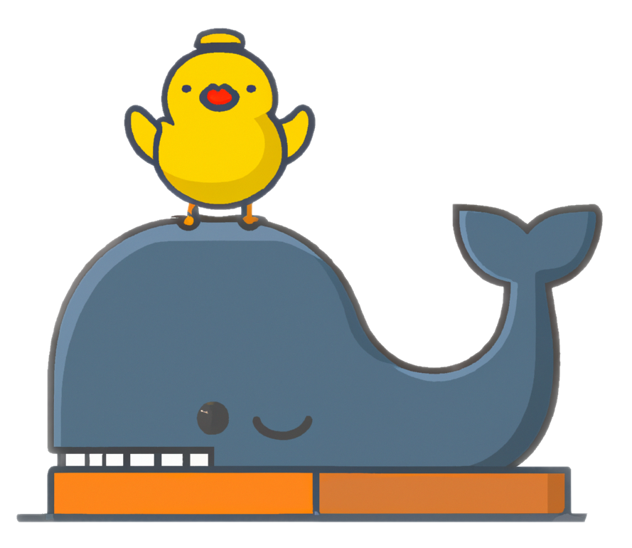

</img>
<!-- ALL-CONTRIBUTORS-BADGE:START - Do not remove or modify this section -->
[](#contributors-)
<!-- ALL-CONTRIBUTORS-BADGE:END -->


# Ducker
- Ducker the docker helper. Ducker is go language based CLI application for easier docker usage purpose.

# Disclaimer
- Ducker has been developed for me and my organization usage purpose. It might not be suitable for everyone, however, I am willing to expand general purpose docker helper application. If you have any ideas, thought, and complains, please let me know. It would be much appreciated to build better tools for everyone.

# Install
## Linux
### x86_64
```shell
curl https://raw.githubusercontent.com/JeiKeiLim/ducker/main/install.sh | bash -s install linux amd64
```

### arm64
```shell
curl https://raw.githubusercontent.com/JeiKeiLim/ducker/main/install.sh | bash -s install linux arm64
```

### arm (32 bit)
```shell
curl https://raw.githubusercontent.com/JeiKeiLim/ducker/main/install.sh | bash -s install linux arm
```

## MacOS
### Intel
```shell
curl https://raw.githubusercontent.com/JeiKeiLim/ducker/main/install.sh | bash -s install darwin amd64
```

### M1 chip
```shell
curl https://raw.githubusercontent.com/JeiKeiLim/ducker/main/install.sh | bash -s install darwin arm64
```

# Uninstall
```shell
curl https://raw.githubusercontent.com/JeiKeiLim/ducker/main/install.sh | bash -s uninstall
```

# How to use
## Init
```shell
$ ducker init

Enter your name(Default: Anonymous): Jongkuk Lim
Enter contact address (Default: None): lim.jeikei@gmail.com
Success!
Dockerfile has been created in docker directory
```

This will generate basic `Dockerfile` and `Dockerfile.aarch64` under `./docker/` directory which you can find in [docker/Dockerfile](docker/Dockerfile) and [docker/Dockerfile.aarch](docker/Dockerfile.aarch). This basic Dockerfile contains ubuntu environment of parent's user permission(UID and GID) with NVIDIA CUDA ready (if possible) and oh-my-zsh support. Once you have successfully initialized Dockerfile, you are ready to build docker image.

You can insert cutom template dockerfile.
```shell
$ ducker init -t python
```

This will put [templates/python.Dockerfile](templates/python.Dockerfile) contents after [docker/Dockerfile](docker/Dockerfile). 


## Build
```shell
$ ducker build

...
Successfully tagged jeikeilim/ducker_test:x86_64
```

Docker image name is automatically generated by `Organization Name`/`Parent's directory name`:`Architecture name`. So you don't need to think about the naming convention. Now you are ready to run the docker container.

## Run
```shell
$ ducker run

─ ducker run
docker run --privileged -tid -e DISPLAY=:0 -e TERM=xterm-256color -v /tmp/.X11-unix:/tmp/.X11-unix:ro -v /dev:/dev --gpus all -v /home/limjk/.gitconfig:/home/user/.gitconfig --network host  jeikeilim/ducker_test:x86_64 /usr/bin/zsh
cabbba0649c1800395a49f0037a5d459fd78d06835e5f0841c2529fb8d72a5e0
[powerlevel10k] fetching gitstatusd .. [ok]
user@mypc  ~ echo hello from ducker
hello from docker
```

`ducker run` will execute docker command with privilleged, display and gpu support, git config(if possible), and host network configuration.

## Exec
```shell
$ ducker exec
user@mypc ~ 
```

`exec` command runs last container you ran.


# Roadmap
- Custom base docker image
- Global configuration file for better flexibility
- Your idea


## Contributors ✨

Thanks goes to these wonderful people ([emoji key](https://allcontributors.org/docs/en/emoji-key)):

<!-- ALL-CONTRIBUTORS-LIST:START - Do not remove or modify this section -->
<!-- prettier-ignore-start -->
<!-- markdownlint-disable -->
<table>
  <tbody>
    <tr>
      <td align="center"><a href="https://limjk.ai"><br /><sub><b>Jongkuk Lim</b></sub></a><br /><a href="https://github.com/JeiKeiLim/ducker/commits?author=JeiKeiLim" title="Code">💻</a> <a href="#ideas-JeiKeiLim" title="Ideas, Planning, & Feedback">🤔</a></td>
      <td align="center"><a href="https://github.com/ulken94"><br /><sub><b>Haneol Kim</b></sub></a><br /><a href="https://github.com/JeiKeiLim/ducker/commits?author=ulken94" title="Code">💻</a></td>
    </tr>
  </tbody>
</table>

<!-- markdownlint-restore -->
<!-- prettier-ignore-end -->

<!-- ALL-CONTRIBUTORS-LIST:END -->

This project follows the [all-contributors](https://github.com/all-contributors/all-contributors) specification. Contributions of any kind welcome!
